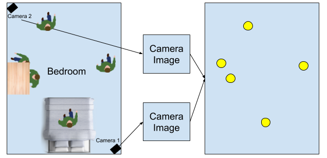
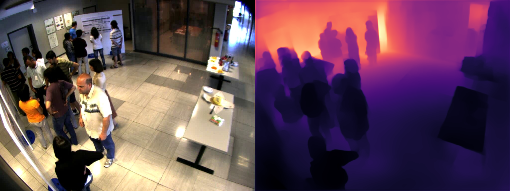
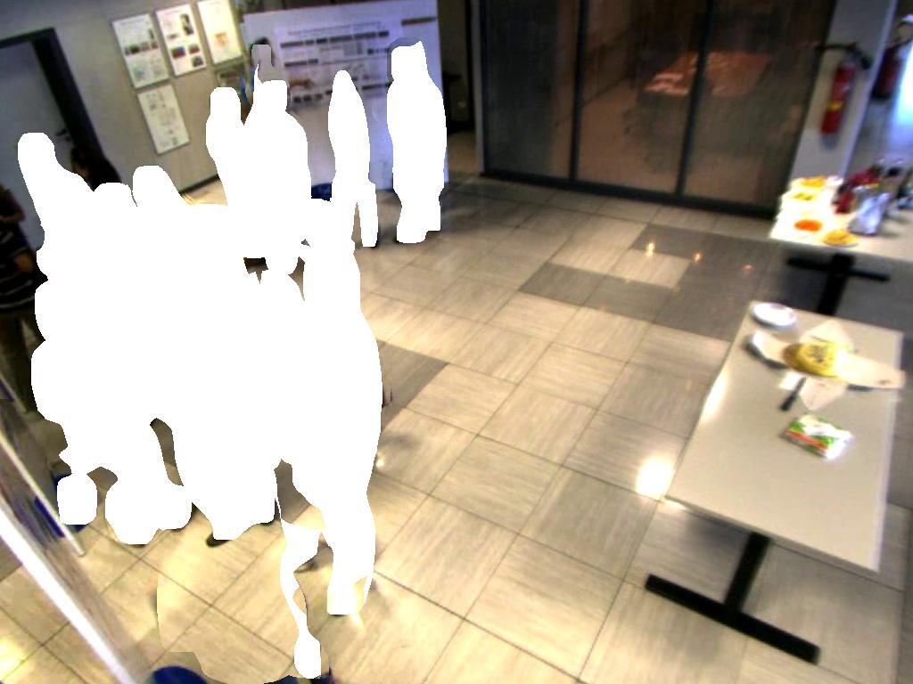

# Watchman

Welcome to Watchman, a Fall 2020 [Launchpad](https://launchpad.berkeley.edu/) project.

## Project Goal
Cameras are almost everywhere. For reasons of security, or otherwise, cameras have become one of the most ubiquitous sensors we have. Many of these cameras exist in spaces we're interested in tracking and understanding from malls, to stores, to train stations and many other public spaces. However, a camera loses information about the real world. It looses information in the sense that we as humans recognize the nature of scenes in 3D while cameras simply project these real-world objects into a camera frame based on a specific camera model. We want to create an easy-to-use pipeline for taking that raw data from multiple cameras and then trying to reconstruct a global representation of a scene from it, at which point one can then track objects of interest (people, balls, cars, etc). This allows the monitoring of these spaces to happen with respect to where things actually are in the real-world.

For this project, we show two different "global representations" to understand locations of people in some enclosed space. One approach tries to reconstruct the 3D nature of the scene while the other approach sticks which pure computer vision based approaches to achieve a top-down view of the scene.

## Dataset
We used "Multi-Camera People Tracking Datasets" featured [here](https://tev.fbk.eu/technologies/multi-camera-people-tracking-datasets).

## Pinhole Camera Model and Camera Projections
Fundamentaly, cameras are able to capture images by capturing the way light travels in a space and how it interacts with specific camera lenses. A pinhole camera captures this light via a small hole (pinhole) which light can pass through and create an inverted image from. In a physical camera, these light rays are captures by a surface which is sensitive to light. In the real-world, light can either be absorbed by an object or be projected back into the scene. Some of the light projected back into the scene in the direction of the camera, is what it's able to capture.

While there are many different cameras that use different types of lenses with different amounts of distortions, etc, we can model all of them with a simple pinhole model. Different lenses and different sizes of the pinhole cause different projection effects in our actual camera frame.

Small Aperture (Small Pinhole Size) |  Large Aperture (Large Pinhole Size) | Lens Distortions
:-------------------------:|:-------------------------:|:-------------------------:
  |   | 

All these effects we see can be described in a few different paramenters, namely with the intrinsic and extrinsics matrices. The intrinsic matrix models some of the properties described above including the optical center and scaling effects while the extrinsics matrix describes the position of the camera in the real-world. These two matrices are then able to relate 2D coordinates to 3D coordinates via simple linear algebra.

Learn more about pinhole cameras [here](https://www.scratchapixel.com/lessons/3d-basic-rendering/3d-viewing-pinhole-camera) and [here](http://ksimek.github.io/2013/08/13/intrinsic/#:~:text=The%20Pinhole%20Camera,ideal%20pinhole%20camera%2C%20illustrated%20below.&text=Each%20intrinsic%20parameter%20describes%20a%20geometric%20property%20of%20the%20camera.)!

## Approach 1: 3D Reconstruction and Tracking
Now that we've learned about pinhole cameras, we can learn about how we are to correlate multiple camera frames and recover 3D data.

### Depth Estimation
A fundamental part of understand a 3D scene from single images is this idea of a disparity map. A disparity map is simply inverse depth which for every pixel describes how far away it is from the camera, in the real-world. It's what powers much of the portrait mode pictures on many smartphones today and a lot of AR research as well. Traditionally, these disparity maps are constructed via a pair of stereo images which use principals similar to the depth perception we have with two eyes. However, we only have access to monocular cameras given that we put the restraint on ourselves to work with really any set of security cameras that exist widely throughout various places.

To extract depth from monocular images, we used deep learning. Specifically, we tried using both [Monodepth2](https://github.com/nianticlabs/monodepth2) and [DenseDepth](https://github.com/ialhashim/DenseDepth). Without getting too specific, most of the recent monocular depth estimation networks use depth estimation as a side-task while solving an auxiliary task such as learning visual transformations to images that are before and after in a driving sequence for example. To learn more, visit their respective links though!

### Projecting into 3D
After doing depth estimation, we have access to a depth map associated with an image. Using camera intrinsics, we have the ability to now recover the real world points associated with the pixels in the image. This is done by solving the matrix equations from the pinhole camera section using camera intrinsics. Below is an example of a depth map created from sample data.

### Detecting People
For this, we simply used YOLO and projected the center bounding box points into the real-world.

### Visualization
After projecting into 3D, we obtain the following. The green things are where people are centered in the 3D world.

### People Noise
One might botice the weird abberations caused by the people. This is expected since the camera is simply unable to see anything else behind a person from simply one angle. To alleviate this, we created a depth map + image corrected based on semantic segmentation. What this entails is simply correcting the depth map over many iterations by first starting off with an empty map and then filling it in based on parts of the scene that don't contain any dynamic objects (chairs, people, etc). This essentially is able to "fill in" the scene and replace all occurences of people.

Another way to fix this issue which is orders of magnitude better is by combining multiple camera views but that is being put in for future work.

After we "fill in" gaps, we get what we see below. As you can see, there are still many holes. However, these holes can be filled even more over time as people move around more.

## Approach 2: Homography Transformation

### README explanation coming soon

# Project Credits
Mokshith Voodarla\
Sumer Kohli\
Billy Wang\
Sean Kim\
Max Emerling\
Devang Jhabakh Jai\